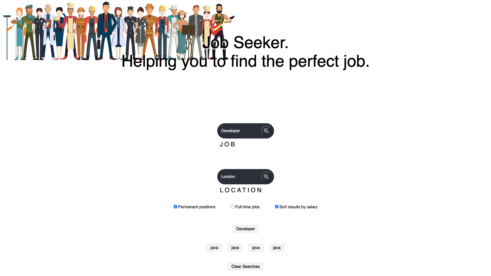
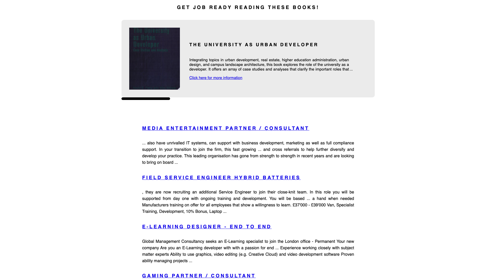

# IT’s the Job!

A Job searching application that run in the browser and feature dynamically updated HTML and CSS using JavaScript (jQuery). This project is a app with search functionality to find current open positions in the UK for multiple cities and also reccomend relevant books to read for that positons subject. It uses the ADZUNA API to retrieve data for the positions and Google Books API to retrieve data for the books, AJAX to hook into the API to retrieve the data in JSON format, dynamically updated HTML and CSS powered by jQuery, and displays a search history which the user can click to access past positons searched via local storage.

.

## Installation
No instalation required

## Usage
1. Simply type the name of the position you desire, the location of your preference and click the search button.
2. You can also select from the list of positions previously searched to see it again.

## Authors:
 _Antonio Guedes_
 _Mo Pishdar_
 _Anna Chong_
 

## Project status
Completed.

## Deployment
You can find the live site at: https://guedesantonio.github.io/JOB-SEARCH-APP/

## References
1. https://purecss.io/ - Purecss library
2. https://jquery.com/ - jQuery library
3. https://material.io/ - Free Icons!
4. https://developer.adzuna.com/overview - Adzuna API
5. https://developers.google.com/books - Google Books API
6. https://developer.mozilla.org/en-US/ - Various documentation
7. https://stackoverflow.com/ - Questions & Answers
